# 💊 E-Inject

## 📝 Overview
**E-Inject** is a modern medicine-based e-commerce platform that aims to provide a seamless digital pharmacy experience. It enables users to browse, order, and track medicines from anywhere, anytime. The platform is being developed using the MERN stack (MongoDB, Express.js, React.js, Node.js) and ensures secure authentication & ordering through JWT-based access control.

**Tagline:** _"Your Trusted Digital Medicine Store"_

---

## 🚀 Key Features

| Feature | Description |
|--------|-------------|
| **🔐 JWT Authentication** | Secure user authentication & authorization using JWT based auth in Node backend |
| **💊 Browse Medicines** | Users can explore medicine categories, brands, and product types |
| **🛒 Add to Cart & Ordering** | Users can add medicines to the cart and place secure orders |
| **📦 Order Tracking** | Track real-time order status |
| **🛠 Admin Panel** | Admin can add, update, delete medicines, see user details, and manage orders |
| **📂 Data Storage**          | Store user data and medicines information in [MongoDB](https://www.mongodb.com/). 

---

## 🧰 Tech Stack (Planned)

| Technology | Purpose |
|------------|----------|
| **MongoDB** | NoSQL database for storing products & orders |
| **Express.js** | Backend REST API development |
| **React.js** | Frontend UI development |
| **Node.js** | Backend runtime environment |
| **JWT** | Authentication mechanism |
| **GitHub** | Version control & team collaboration |

---

## Table of Contents

- [Overview](#-overview)
- [Key Features](#-key-features)
- [Tech Stack](#-tech-stack-planned)
- [Screens / Pages](#screens--pages)
- [Installation](#installation)
- [Environment Variables](#environment-variables)
- [Running The Application](#running-the-application)
- [Contact](#contact)

---

## Screens / Pages

### Home Page
The Home page shows featured medicines, highlighted categories and top sections for quick access.

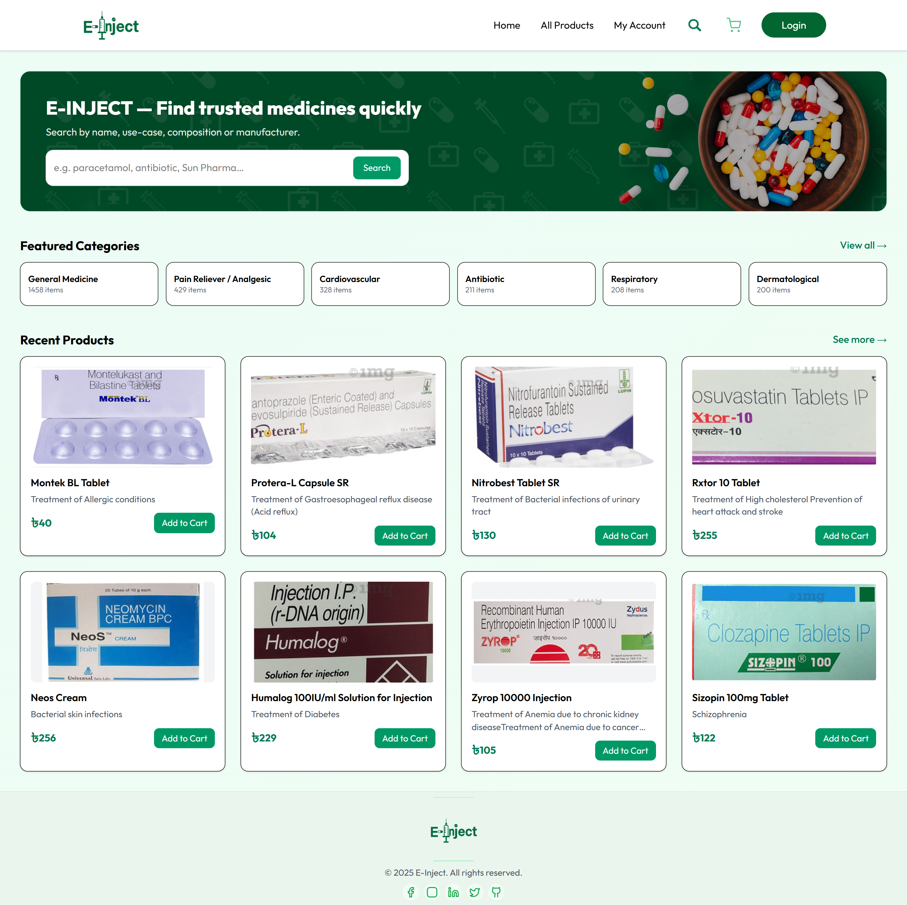

### All Products Page
This page displays all available medicines and products for users to browse.

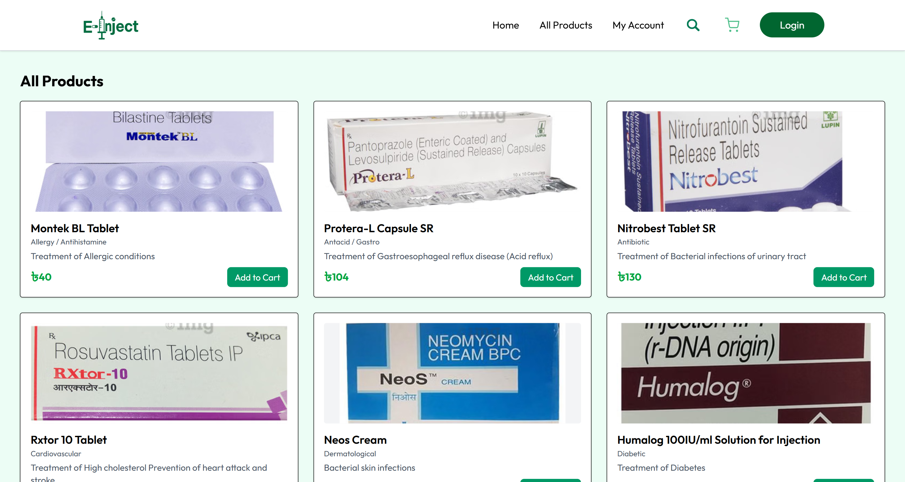

### Signup Page
New users can create account here by providing required user information.

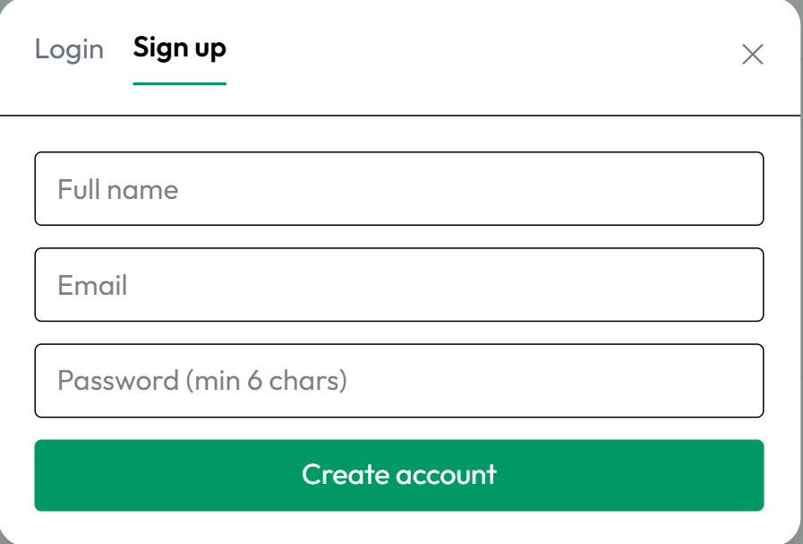

### Login Page
Existing users can login using JWT based authentication to access their account.

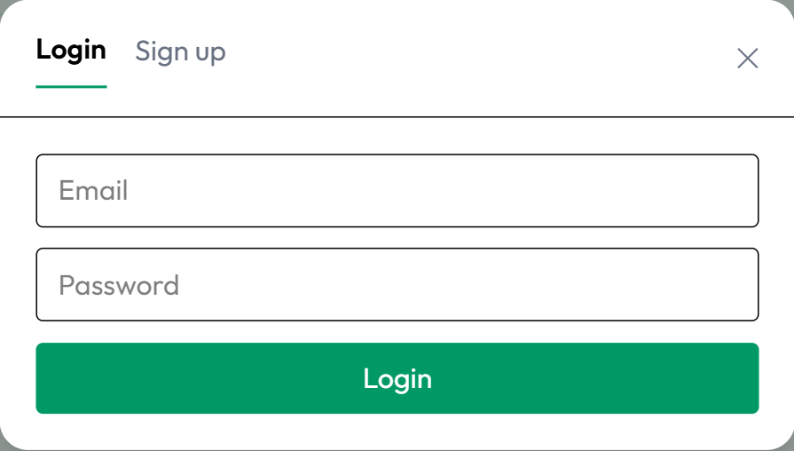

### My Account Page
Users can manage profile info & personal settings here.

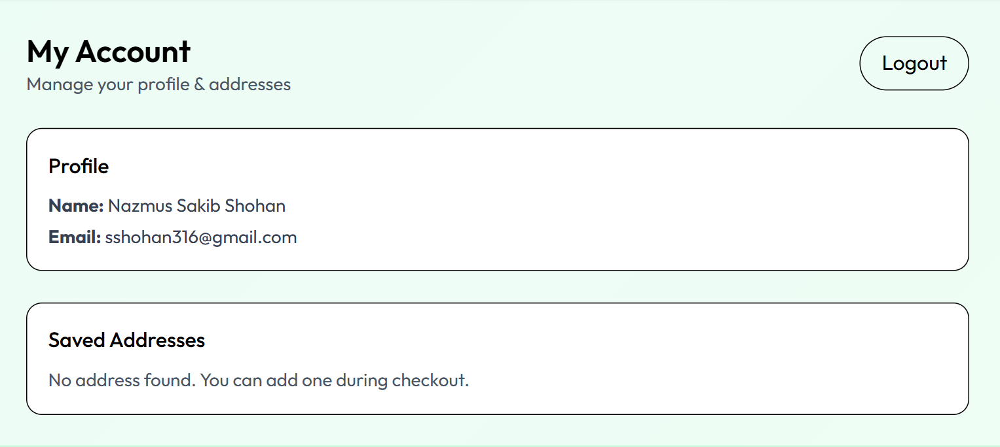

### Cart Page
Users can view products added to cart before placing order.

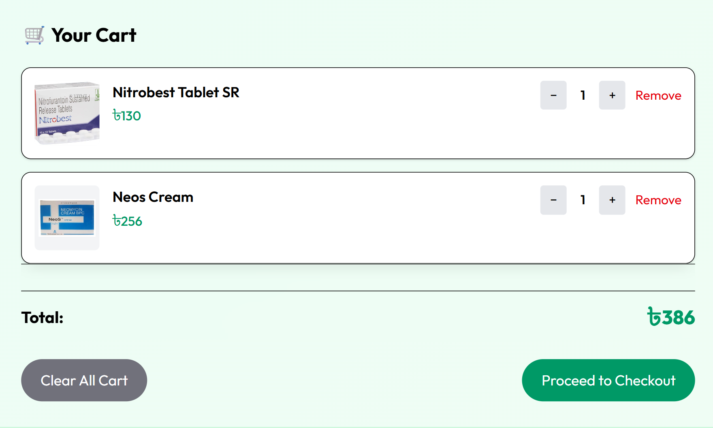

### Checkout Page
Users confirm shipping & finalize purchase from this page.

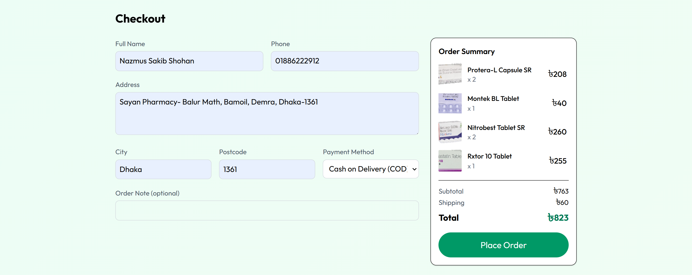

### Order Success Page
After successfully placing an order users see success confirmation.

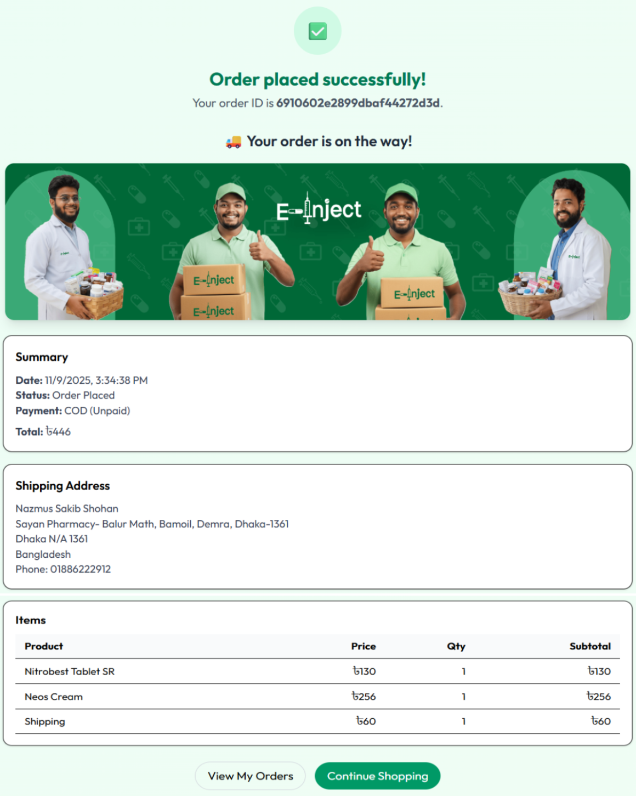

### My Orders Page
Users can view and track all their previous orders.


### Admin Login Page
Admin uses this page to login to the admin panel securely.

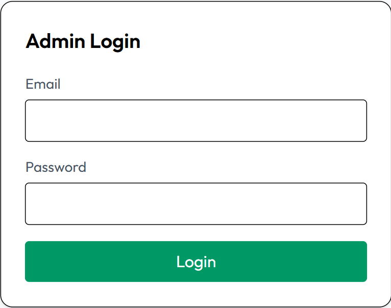

### Admin Dashboard
Admin can see overall stats, overview & system summary here.

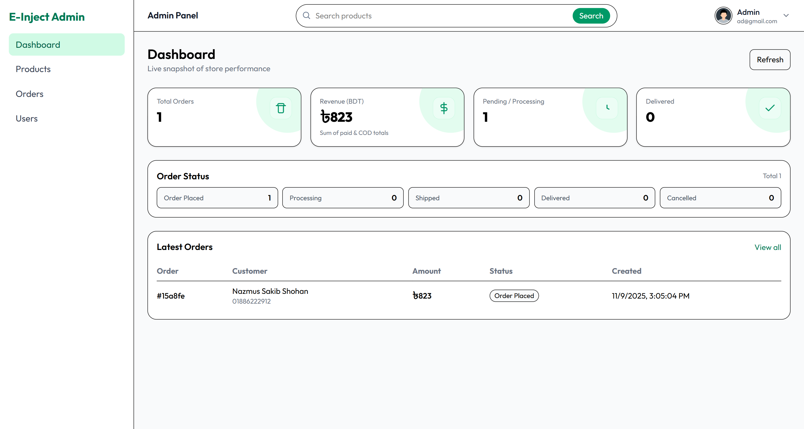

### Admin Products Page
Admin can see all products and manage product list.

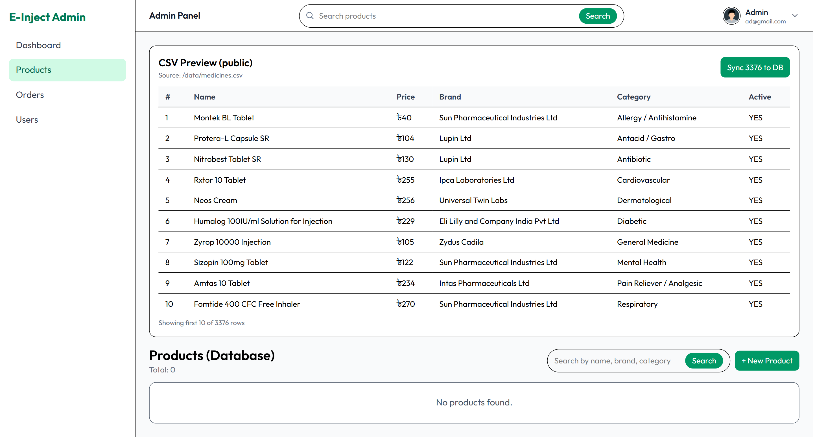

### Add Product (Manual)
Admin can add a single product manually through a form.


### Add Product (List)
Admin can add multiple products by uploading file/list.


### Admin Orders Page
Admin can see and handle user orders from here.

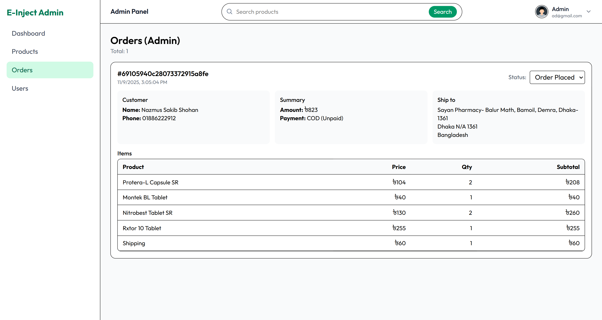

### Admin Users Page
Admin can see & manage registered users.

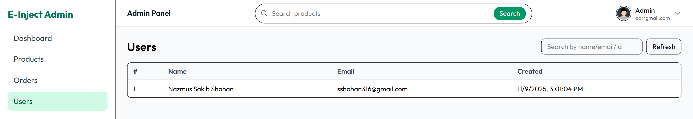


---

## Installation

```sh
git clone https://github.com/yourusername/e-inject.git
cd e-inject
cd backend
npm install
cd ../frontend
npm install
```
## Environment Variables
Create a .env file in the backend directory and add the following environment variables:
```sh
DB_URL="your_mongodb_connection_string"
PORT=5000
JWT_SECRET_KEY="your_jwt_secret_key"
```
Running the Application
Start the backend server:
```sh
cd backend
npm run dev
```
Start the frontend development server:
```sh
cd frontend
npm run dev
```
